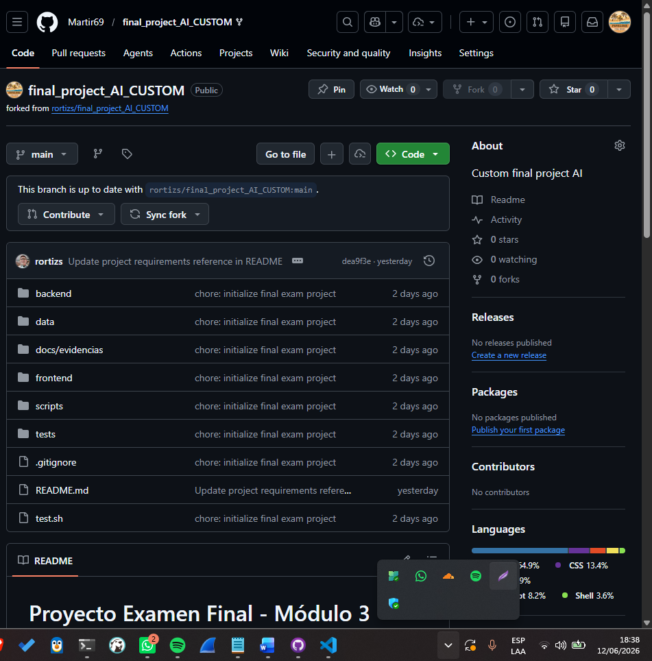
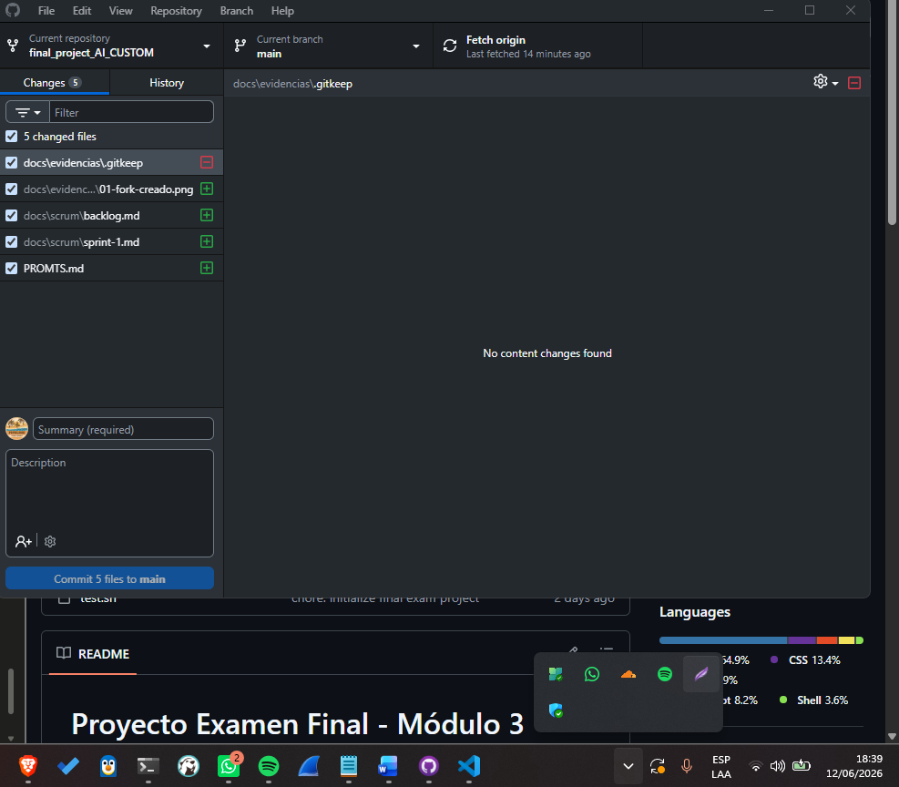
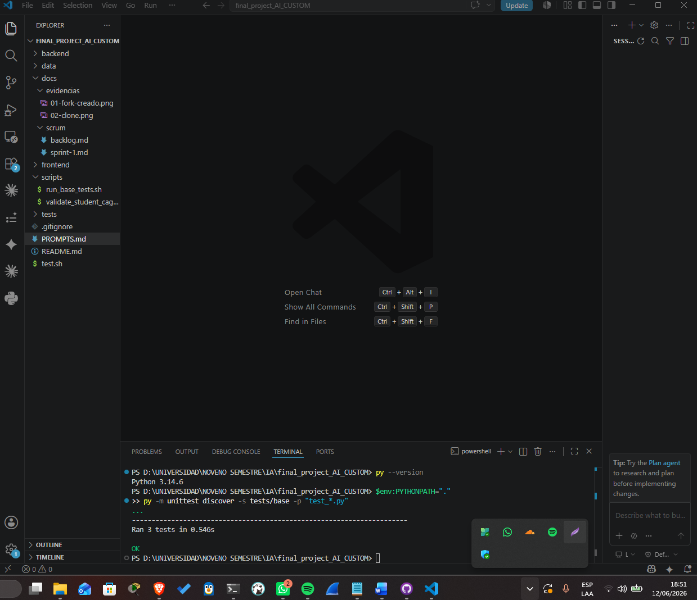

# Sprint 1 — Análisis y diseño

**Objetivo del sprint:** Entender el proyecto base, verificar pruebas base, 
diseñar la solución CAG y escribir escenarios BDD.

## Planificación
- [x] Fork público del repositorio base
- [x] Clone local del fork
- [x] Estructura de documentación creada
- [x] Ejecutar pruebas base y confirmar que pasan
- [ ] Analizar arquitectura actual (frontend, backend, RAG)
- [ ] Escribir SDD (diseño de la solución)
- [ ] Escribir escenarios BDD

## Evidencias

