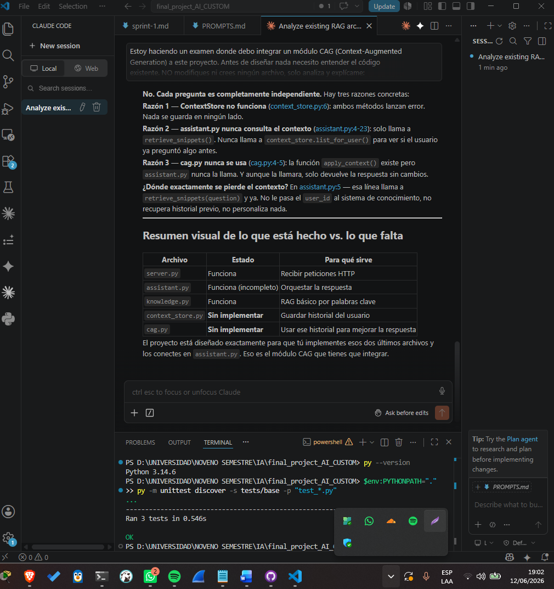

# Sprint 1 — Análisis y diseño

**Objetivo del sprint:** Entender el proyecto base, verificar pruebas base, 
diseñar la solución CAG y escribir escenarios BDD.

## Planificación
- [x] Fork público del repositorio base
- [x] Clone local del fork
- [x] Estructura de documentación creada
- [x] Ejecutar pruebas base y confirmar que pasan
- [x] Analizar arquitectura actual (frontend, backend, RAG)
- [x] Escribir SDD (diseño de la solución)
- [x] Escribir escenarios BDD

## Hallazgos del análisis
- La lógica RAG vive en backend/knowledge.py (búsqueda por palabras clave 
  sobre data/knowledge_base.json).
- El proyecto ya define la capa intermedia como esqueletos vacíos: 
  backend/context_store.py y backend/cag.py.
- assistant.py no consulta contexto ni llama a apply_context(); 
  context_used siempre queda vacío. Ahí se integra el CAG.
- El contrato de la validación final fija rutas (/api/context, /api/ask), 
  códigos (201/200) y campos JSON (saved, user_id, context, answer, context_used).

## Cierre del sprint
Sprint completado. El diseño quedó documentado en docs/SDD.md y los 
escenarios de comportamiento en docs/BDD.md. Siguiente sprint: implementación 
TDD del módulo CAG en la rama feature/cag.

## Evidencias

