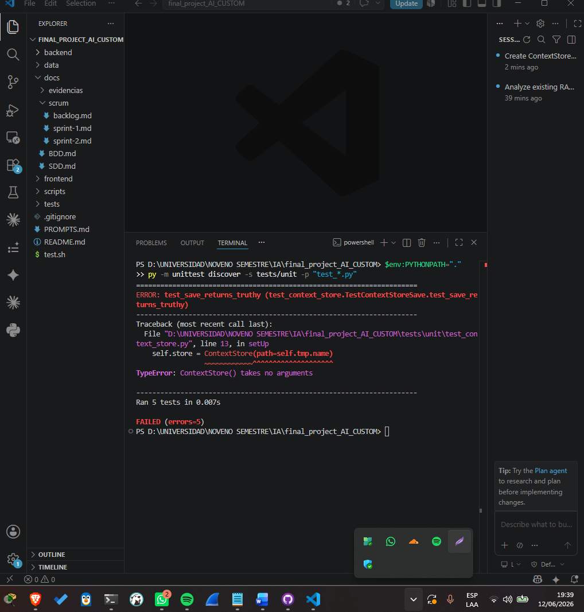
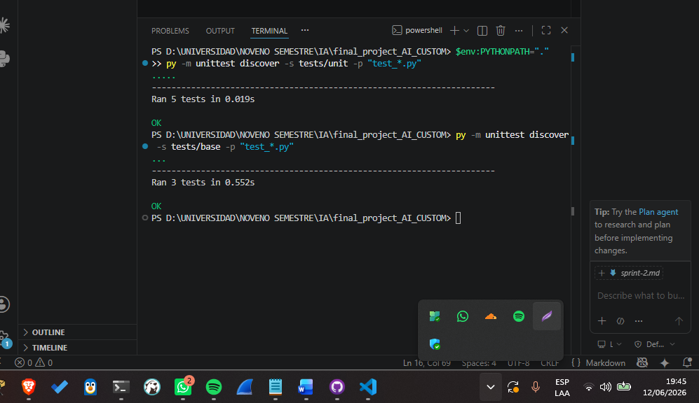
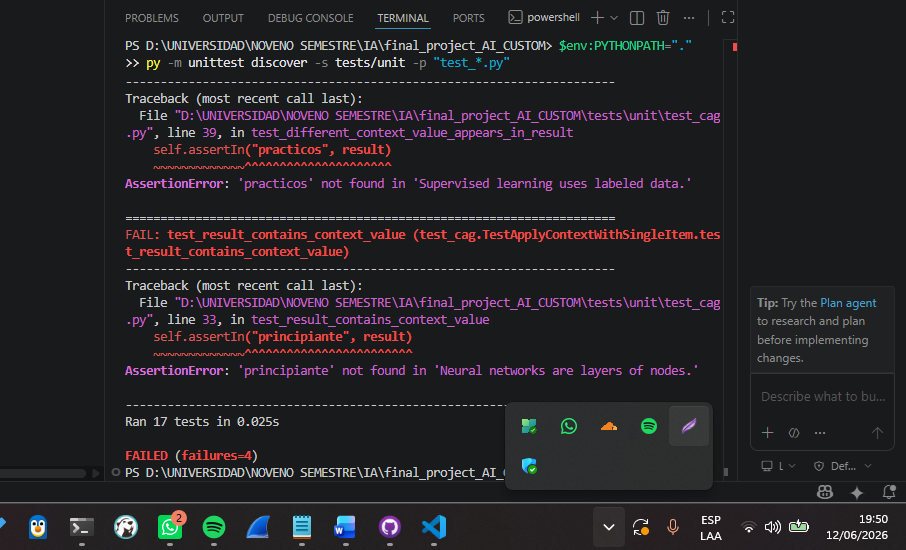
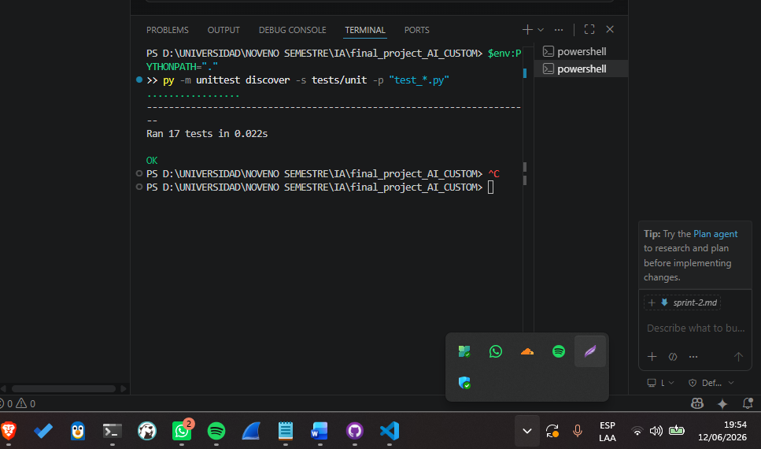

# Sprint 2 — Implementación TDD del módulo CAG

**Objetivo del sprint:** Implementar ContextStore y apply_context con ciclo 
TDD (rojo → verde) en la rama feature/cag.

## Planificación
- [x] Crear rama feature/cag
- [x] Pruebas unitarias de ContextStore (fase roja)
- [x] Implementar ContextStore.save y list_for_user (fase verde)
- [x] Pruebas unitarias de apply_context (fase roja)
- [X] Implementar apply_context (fase verde)
- [X] Confirmar que las pruebas base siguen pasando

## Evidencias

## Cierre del sprint
Sprint completado. ContextStore y apply_context implementados con ciclo TDD 
completo (2 fases rojas, 2 verdes), 17 pruebas unitarias propias en verde y 
las 3 pruebas base del proyecto intactas. Siguiente sprint: integración en 
assistant.py y server.py para cumplir el contrato de validación.