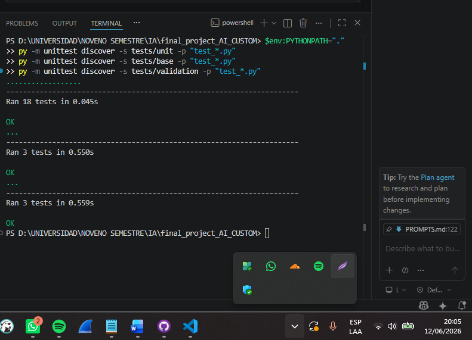

# Sprint 4 — Validación final, PR y documentación

**Objetivo:** Ejecutar validación final, abrir y mergear el PR, actualizar README.

## Planificación
- [x] Pasar las pruebas de validación del profesor (3 OK)
- [x] Actualizar README.md con arquitectura, resultados y guía de navegación
- [ ] Abrir Pull Request feature/cag → main, revisarlo y mergear

## Cierre del sprint
(se completa tras el merge del PR)

## Evidencias
